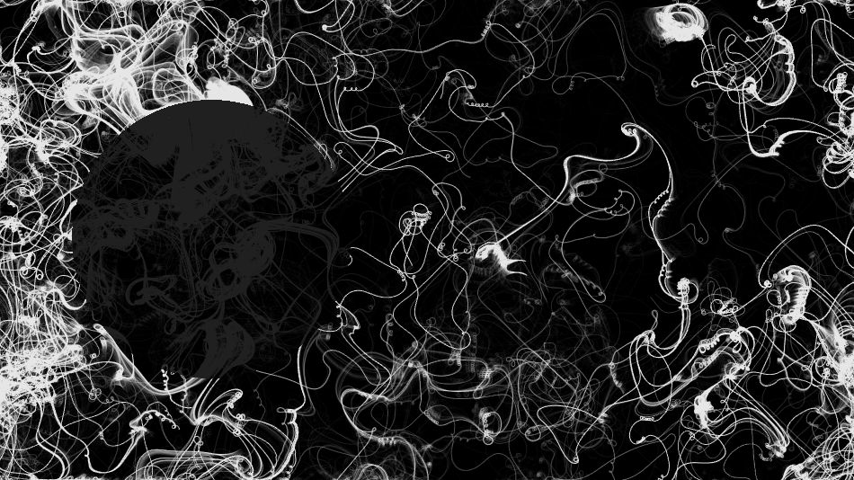
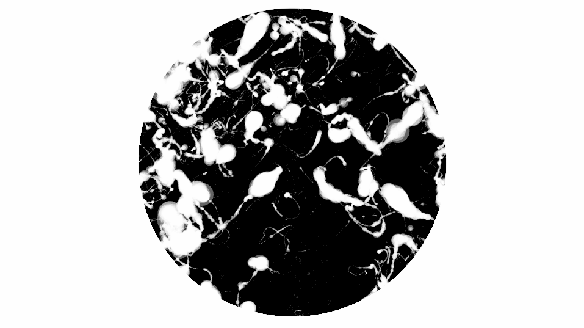

As we go through life, we often miss out on things going on around us, or focus on things that only apply to ourselves. **Perception** is an algorithmic simulation representative of our impressions of society, and a portrayal of our mental fixations.

[**Perception 1.0**](https://vimeo.com/195498389)

[**Perception 2.0**](https://vimeo.com/195498401)

###Sound Design: 
**Bells** and **Choirrr** by Audri Acuña

[**Sune**](soundcloud.com/sunemusic)
[**Audri Acuña**](soundcloud.com/lindred)